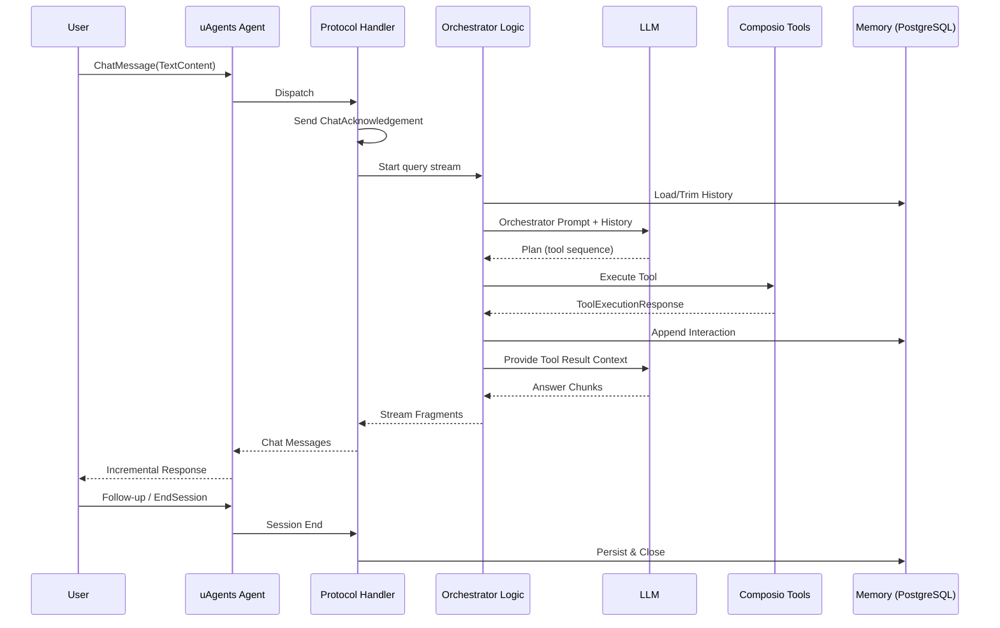
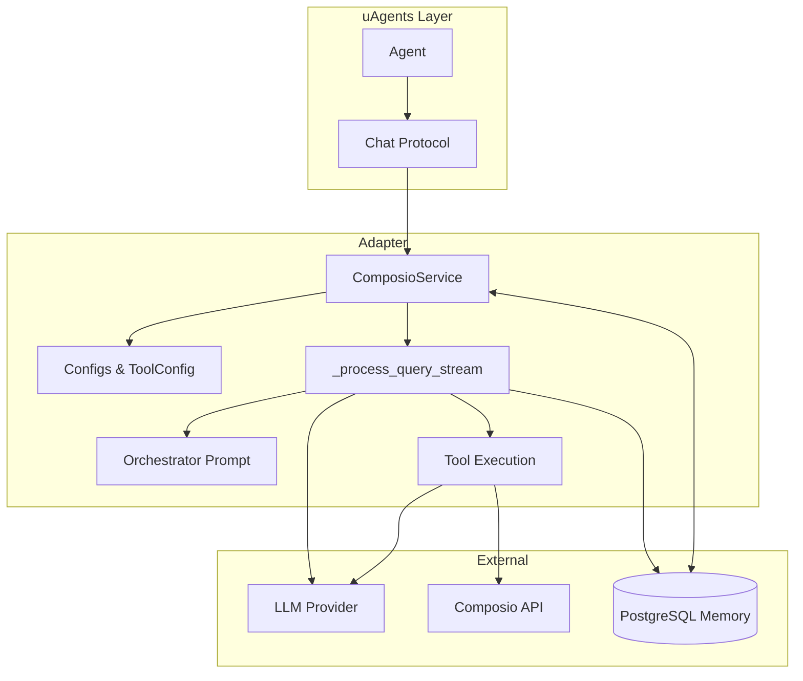

# Architecture Overview

## 1. High-Level Purpose

`uagents-composio-adapter` provides an integration layer that lets uAgents-based conversational or autonomous agents seamlessly discover, authenticate, and execute external service tools exposed through Composio while orchestrating reasoning via an LLM (LangChain stack) and optionally persisting conversational memory (PostgreSQL).

Primary goals:
- Uniform service (`ComposioService`) to configure tool access and manage execution.
- Multi-agent style orchestration: an orchestrator prompt guides sequential specialized tool agent invocations.
- Streamed, chat-protocol compliant responses for real-time UX.
- Hooks for authentication, memory, and lifecycle management.

## 2. Core Components

### 2.1 Service Layer
- **`ComposioService`**: Central façade; wires protocol handling, LLM usage, tool retrieval, execution, and (optional) persistence. Exposes:
  - `protocol` (uAgents `Protocol`) – registered message handler.
  - `health_check()` – runtime diagnostics.
  - `cleanup()` – graceful resource teardown.
  - Internal pipelines: `_process_query_stream`, `_run_agent_query`, `_send_chat_message`, orchestration prompt builder.

### 2.2 Configuration & Models
- **`ComposioConfig`** – API key, persona prompt, timeout, list of `ToolConfig`.
- **`ToolConfig`** – declarative tool selection (explicit list, toolkit name, or search query) bound to an `auth_config_id` for user/service authentication context.
- **`Modifiers` / Hook Type Aliases** – optional schema and execution-phase mutation (`schema_modifier`, `before_execute`, `after_execute`).
- **Memory Config (`PostgresMemoryConfig`)** – connection parameters for persistent conversation storage (optional).
- **Custom Exceptions** – `ComposioError` + specific subclasses (configuration, authentication, retrieval, execution) for precise error handling.

### 2.3 Messaging / Protocol
- Relies on uAgents chat protocol primitives: `ChatMessage`, content variants (`TextContent`, `StartSessionContent`, `EndSessionContent`, `MetadataContent`), and `ChatAcknowledgement` for acknowledgment semantics.
- `_handle_message` (exposed through the `protocol` property) branches by content type and delegates textual queries to the streaming pipeline.

### 2.4 Orchestration & Tool Execution
- Builds an orchestrator prompt enumerating available tool agents with rules enforcing:
  1. Structured reasoning before acting.
  2. Sequential tool invocation with explicit data passing.
  3. Tool result summarization and relevance extraction.
- Integrates with Composio client for:
  - Tool discovery (by toolkit or search).
  - Tool execution (parameter serialization + response normalization).
- Uses LangChain core utilities for message trimming and approximate token budgeting.

### 2.5 Memory (Optional)
- PostgreSQL connection pool (async) maintains historical conversation state.
- Token-aware trimming prior to LLM calls using approximate counters; future summarization pathways are implied but not yet implemented.

### 2.6 Public API
- Re-exported names in `__init__.py` enable succinct imports, e.g. `from uagents_composio_adapter import ComposioService, ToolConfig`.

## 3. Data & Control Flow

1. Incoming `ChatMessage` arrives via uAgents runtime.
2. `ComposioService.protocol` dispatches to `_handle_message`.
3. Acknowledgement sent (`ChatAcknowledgement`).
4. For each content item:
   - `StartSessionContent`: initialize session context (memory load / allocate structures).
   - `TextContent`: forwarded to `_process_query_stream`.
   - `MetadataContent`: logged / potentially merged into context.
   - `EndSessionContent`: triggers session finalization (persist & cleanup markers).
5. `_process_query_stream`:
   - Gathers history (memory or in-memory buffer) and trims if needed.
   - Assembles orchestrator prompt + tool specification.
   - Invokes LLM; interprets planned tool calls.
   - Executes selected Composio tools (`_run_agent_query`), applying modifier hooks.
   - Streams intermediate reasoning + tool outputs as chunks.
6. `_send_chat_message` packages each chunk back over the chat protocol.
7. Memory layer persists both the user input and agent/tool responses.

## 4. External Integrations

| System      | Purpose |
|-------------|---------|
| Composio API | Tool discovery, auth, and execution |
| LangChain LLM | Reasoning, planning, response generation |
| uAgents Protocol | Transport & structured chat content model |
| PostgreSQL (optional) | Persistent memory & session history |

## 5. Example Use Case Flow

User: "Create an issue for the login timeout bug and then list recent open issues."

Sequence:
1. Text arrives -> `_handle_message` -> `_process_query_stream`.
2. Orchestrator prompt enumerates (e.g.) GitHub tool agent.
3. LLM plan step: decide to call `GITHUB_CREATE_ISSUE` with extracted title/body.
4. Service executes tool via Composio, obtains issue URL.
5. LLM (given tool result context) plans follow-up: call `GITHUB_LIST_ISSUES`.
6. Second tool executed; results summarized.
7. Streamed chunks: planning rationale, issue creation confirmation, list summary, final consolidated answer.
8. Memory updated after each major step.

## 6. Limitations / Potential Bottlenecks

| Category | Limitation |
|----------|------------|
| Concurrency | Tool calls appear serialized; no parallel plan execution. |
| Token Handling | Approximate counting may cause boundary misses for strict model limits. |
| Prompt Growth | Larger tool inventories inflate orchestrator prompt size (latency + cost). |
| Resilience | Lacks built-in retry/backoff or circuit breakers for external API errors. |
| Observability | No metrics/tracing hooks (only logging). |
| Memory Depth | No semantic/vector retrieval; only trimming. |
| Streaming Semantics | Streams plain text; lacks structured event schema. |
| Rate Limiting | No adaptive throttling across multiple simultaneous sessions. |

## 7. Future Improvements

1. Parallel / dependency-aware tool planning & execution.
2. Adaptive token budgeting with summarization or semantic relevance pruning.
3. Pluggable memory backends (Redis, vector stores) + retrieval augmentation.
4. Structured streaming events (JSON frames: plan, executing, tool_result, final_answer).
5. Robust retry strategy with exponential backoff & circuit breaking for Composio/LLM.
6. Enhanced auth lifecycle (token refresh, revocation detection, multi-tenant scoping).
7. Config-as-code (YAML) for tool groups, persona, limits, and policies.
8. Built-in metrics (Prometheus) + distributed tracing (OpenTelemetry spans around tool calls & LLM invocations).
9. Security improvements: input validation, PII redaction, permission scoping per tool config.
10. Test expansion: protocol branch coverage, failure injection tests, load tests for streaming.

## 8. Textual Flow Diagram (Mermaid)

## 9. Component Relationship Diagram (Mermaid)

## 10. Summary

`ComposioService` unifies tool-enabled reasoning, protocol handling, and optional persistence for building production-grade, multi-step, tool-augmented agents. Extensibility points (configuration, hooks, memory) are in place, while resilience, observability, and advanced memory retrieval present key areas for iterative enhancement.

---
*This document is generated; keep it updated as new capabilities land (parallel execution, semantic memory, structured streaming, etc.).*
